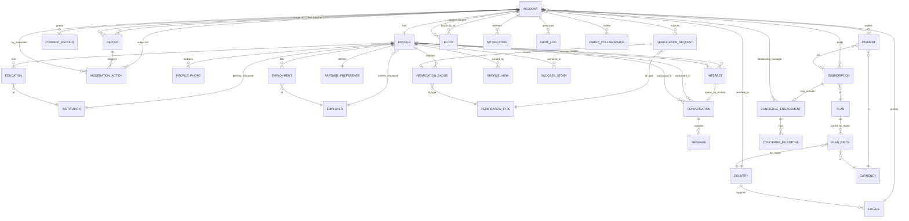

# Entity Relationship Diagram & Data Model — iitiimrishte.com

**Version:** 0.1 (Draft) · **Date:** 2026-07-22
**Companion to:** [`docs/PRD.md`](./PRD.md) · **Evidence base:** [`docs/research/market-research.md`](./research/market-research.md)

This schema is designed to be directly implementable and to structurally support the PRD's differentiators: **multi-signal verification badges**, **non-enumerable profiles**, **response-fairness**, **international i18n/multi-currency**, and **DPDP/GDPR consent + erasure**.

---

## 1. ER Diagram

---

## 2. Entity Column Specifications

Legend: **PK** primary key · **FK** foreign key · **PII** personal data · **ENC** encrypted at rest (field-level).

### ACCOUNT
| Column | Type | Notes |
|---|---|---|
| id | UUID | **PK**. Internal only. |
| public_handle | ULID/opaque | Public identifier — **non-enumerable** (avoids incumbent's sequential Base64-int IDs). Indexed, unique. |
| email | citext | **PII, ENC**. Unique. |
| phone | text | **PII, ENC**. Unique, E.164. |
| password_hash | text | Argon2id. Null if SSO-only. |
| auth_provider | enum | `password`/`google`/`apple`/`linkedin`. |
| account_status | enum | `pending`,`active`,`suspended`,`banned`,`deactivated`,`erased`. |
| identity_verified | bool | Gates discoverability with eligibility signal. |
| country_id | FK→COUNTRY | Residence / data-residency routing. |
| locale_id | FK→LOCALE | UI language + formatting. |
| created_at / updated_at | timestamptz | |
| deleted_at | timestamptz | Soft-delete; erasure job hard-purges PII. |

### PROFILE
| Column | Type | Notes |
|---|---|---|
| id | UUID | **PK**. |
| account_id | FK→ACCOUNT | Unique (1:1). |
| display_name | text | **PII**. |
| dob | date | **PII, ENC**. Age derived; DOB not exposed. |
| gender | enum | Extensible. |
| height_cm | int | Optional. |
| religion / community | text | **Optional, never required** (anti-caste-gating). |
| mother_tongue | text | |
| marital_status | enum | Attested; escalated verification. |
| profession_title | text | |
| seniority_level | enum | For premium-professional eligibility. |
| income_band | enum | **PII**. Optional; verifiable. |
| current_employer_id | FK→EMPLOYER | Nullable. |
| primary_institution_id | FK→INSTITUTION | Nullable. |
| city / country_id | text / FK | Location + relocation willingness (bool). |
| languages | text[] | |
| partner_intent | enum | `marriage`,`serious_relationship`. |
| intent_timeline | enum | e.g. `<6mo`,`6-12mo`,`exploring`. |
| bio / values | text | |
| incognito | bool | Hidden browsing. |
| visibility_json | jsonb | Per-field visibility settings. |
| last_active_at | timestamptz | **Reachability/freshness ranking.** Indexed. |
| eligibility_basis | enum | `alumni_credential`/`professional_achievement`. |
| created_at / updated_at | timestamptz | |

**Indexes:** `(country_id, city)`, `(last_active_at desc)`, `(seniority_level, income_band)`, GIN on `languages`; vector index on a compatibility embedding column (V2).

### PROFILE_PHOTO
| Column | Type | Notes |
|---|---|---|
| id | UUID | **PK**. |
| profile_id | FK→PROFILE | |
| storage_key | text | Object-store ref (isolated media bucket). |
| blur_until_mutual | bool | Consent-gated reveal. |
| is_primary | bool | |
| liveness_linked | bool | Tied to verification selfie (anti-stock/steal). |
| moderation_status | enum | `pending`,`approved`,`rejected`. |
| created_at | timestamptz | |

### EDUCATION
| Column | Type | Notes |
|---|---|---|
| id | UUID | **PK**. |
| profile_id | FK→PROFILE | |
| institution_id | FK→INSTITUTION | |
| degree / field | text | |
| start_year / end_year | int | |
| is_verified | bool | Set by VERIFICATION_BADGE. |

### EMPLOYMENT
| Column | Type | Notes |
|---|---|---|
| id | UUID | **PK**. |
| profile_id | FK→PROFILE | |
| employer_id | FK→EMPLOYER | |
| title / seniority | text/enum | |
| start_date / end_date | date | Null end = current. |
| is_verified | bool | |

### PARTNER_PREFERENCE
| Column | Type | Notes |
|---|---|---|
| id | UUID | **PK**. |
| profile_id | FK→PROFILE | Unique (1:1). |
| age_min / age_max | int | |
| height / income / seniority filters | ranges | |
| locations | text[] | Countries/cities. |
| education_level_min | enum | |
| religion_pref / community_pref | text[] | Optional. |
| relocation_ok | bool | |
| dealbreakers_json | jsonb | Hard filters vs soft preferences. |

### VERIFICATION_TYPE (reference)
| Column | Type | Notes |
|---|---|---|
| id | smallint | **PK**. |
| code | enum | `gov_id`,`liveness`,`education`,`employer`,`income`,`marital_status`,`photo`. |
| method | enum | `api_source`,`registrar`,`institution_email`,`document_review`,`aggregator`. |
| is_eligibility_signal | bool | Counts toward eligibility gate. |

### VERIFICATION_REQUEST
| Column | Type | Notes |
|---|---|---|
| id | UUID | **PK**. |
| account_id | FK→ACCOUNT | |
| type_id | FK→VERIFICATION_TYPE | |
| evidence_vault_ref | text | **PII, ENC**. Pointer into isolated document vault — **not** stored on PROFILE. |
| status | enum | `submitted`,`in_review`,`approved`,`rejected`,`expired`. |
| reviewer_account_id | FK→ACCOUNT | Nullable (auto vs manual). |
| source_check_result | jsonb | Registrar/employer/ID-API response. |
| submitted_at / decided_at | timestamptz | |
| retention_expires_at | timestamptz | Evidence purged after verification window (data minimization). |

### VERIFICATION_BADGE
| Column | Type | Notes |
|---|---|---|
| id | UUID | **PK**. |
| profile_id | FK→PROFILE | |
| type_id | FK→VERIFICATION_TYPE | Unique per (profile,type). |
| request_id | FK→VERIFICATION_REQUEST | Provenance. |
| verified_at | timestamptz | Shown on profile. |
| expires_at | timestamptz | Drives re-verification cadence. |
| basis_label | text | Human-readable provenance ("Employer-verified via LinkedIn"). |

> **Badge↔profile attachment:** badges are the *only* verification artifact rendered publicly; the underlying evidence lives in VERIFICATION_REQUEST.evidence_vault_ref inside the access-brokered vault, never joined into discovery queries.

### INTEREST
| Column | Type | Notes |
|---|---|---|
| id | UUID | **PK**. |
| sender_profile_id | FK→PROFILE | |
| receiver_profile_id | FK→PROFILE | Unique pair per direction. |
| status | enum | `sent`,`accepted`,`declined`,`expired`. |
| quality_score | numeric | Anti–low-effort-mass-like gating. |
| expires_at | timestamptz | "Interest expires" fairness nudge. |
| created_at | timestamptz | |

### CONVERSATION
| Column | Type | Notes |
|---|---|---|
| id | UUID | **PK**. |
| participant_a_id / participant_b_id | FK→PROFILE | |
| opened_by_interest_id | FK→INTEREST | Requires mutual consent. |
| contact_revealed | bool | Only on mutual consent, not payment alone. |
| created_at / last_message_at | timestamptz | |

### MESSAGE
| Column | Type | Notes |
|---|---|---|
| id | UUID | **PK**. |
| conversation_id | FK→CONVERSATION | |
| sender_profile_id | FK→PROFILE | |
| body | text | **PII, ENC**. Contact-info redaction pre-consent. |
| safety_flags | jsonb | Harassment/scam detection output. |
| created_at | timestamptz | |
| read_at | timestamptz | |

### PROFILE_VIEW
| Column | Type | Notes |
|---|---|---|
| id | UUID | **PK**. |
| viewer_profile_id | FK→PROFILE | Suppressed if viewer incognito. |
| viewed_profile_id | FK→PROFILE | Powers "who viewed me". |
| viewed_at | timestamptz | |

### PLAN / PLAN_PRICE / CURRENCY (monetization + multi-currency)
**PLAN:** `id` PK, `code` (`free`,`premium`,`concierge`), `tier`, `feature_flags jsonb`, `billing_period`, `active`.
**PLAN_PRICE:** `id` PK, `plan_id` FK, `country_id` FK, `currency_id` FK, `amount numeric`, `tax_rule`, `effective_from/to` — **regional pricing** ($/₹/£/AED/SGD).
**CURRENCY:** `code` PK (ISO-4217), `symbol`, `minor_unit`.

### SUBSCRIPTION
| Column | Type | Notes |
|---|---|---|
| id | UUID | **PK**. |
| account_id | FK→ACCOUNT | |
| plan_id | FK→PLAN | |
| status | enum | `active`,`paused`,`cancelled`,`expired`,`refunded`. |
| auto_renew | bool | **Explicit consent required** (no dark-pattern). |
| outcome_guarantee_json | jsonb | Pause/extend if no reachable matches. |
| current_period_start/end | timestamptz | |

### PAYMENT
| Column | Type | Notes |
|---|---|---|
| id | UUID | **PK**. |
| account_id | FK→ACCOUNT | |
| subscription_id | FK→SUBSCRIPTION | Nullable (one-off/success-fee). |
| currency_id | FK→CURRENCY | |
| amount | numeric | |
| gateway / gateway_ref | text | **PII**. |
| status | enum | `pending`,`succeeded`,`failed`,`refunded`. |
| refund_reason | text | Transparent-refund audit. |
| created_at | timestamptz | |

### CONCIERGE_ENGAGEMENT / CONCIERGE_MILESTONE
**CONCIERGE_ENGAGEMENT:** `id` PK, `subscription_id` FK, `account_id` FK (member), `relationship_manager_id` FK→ACCOUNT, `scope_json`, `status`, `started_at`.
**CONCIERGE_MILESTONE:** `id` PK, `engagement_id` FK, `label`, `target_date`, `status` (`pending`/`met`/`missed`), `met_at` — makes assisted-tier outcomes transparent (vs incumbent's opaque concierge).

### REPORT / MODERATION_ACTION / BLOCK
**REPORT:** `id` PK, `reporter_account_id` FK, `target_account_id` FK, `reason` enum, `evidence_json`, `status`, `created_at`.
**MODERATION_ACTION:** `id` PK, `report_id` FK (nullable), `target_account_id` FK, `moderator_account_id` FK, `action` enum (`warn`/`suspend`/`ban`/`dismiss`), `notes`, `created_at` — **immutable/append-only**.
**BLOCK:** `id` PK, `actor_account_id` FK, `target_account_id` FK, unique pair, `created_at`.

### CONSENT_RECORD (DPDP/GDPR)
| Column | Type | Notes |
|---|---|---|
| id | UUID | **PK**. |
| account_id | FK→ACCOUNT | |
| purpose | enum | `verification`,`matching`,`marketing`,`analytics`,`cross_border_transfer`. |
| granted | bool | **Unbundled, unconditional** (DPDP). |
| policy_version | text | |
| lawful_basis | enum | GDPR basis. |
| granted_at / withdrawn_at | timestamptz | Withdrawal supported. |

### NOTIFICATION
`id` PK, `account_id` FK, `type` enum, `channel` enum (`push`/`email`/`sms`/`whatsapp`), `payload_json` (no identity leak to non-consented parties), `read_at`, `created_at`. Respects per-type toggles + timezone quiet hours.

### AUDIT_LOG
`id` PK, `actor_account_id` FK (nullable for system), `action`, `entity_type`, `entity_id`, `metadata_json`, `created_at` — append-only; covers back-office PII access (least-privilege evidence).

### Reference entities
- **COUNTRY:** `id` PK, `iso_code`, `name`, `data_residency_region`, `default_currency_id`.
- **LOCALE:** `id` PK, `country_id` FK, `language_code`, `formatting_json`.
- **INSTITUTION:** `id` PK, `name`, `country_id`, `type` (`iit`/`iim`/`ivy`/`global_top`/`other`), `aliases[]` — canonicalizes education for facet search.
- **EMPLOYER:** `id` PK, `name`, `domain`, `verification_source` — canonicalizes employment for professional verification.
- **SUCCESS_STORY:** `id` PK, `profile_id` FK, `consented` bool, `body`, `published_at`.
- **FAMILY_COLLABORATOR:** `id` PK, `account_id` FK (owner), `collaborator_email` **ENC**, `role`, `consent_granted` bool — parent/family assist by explicit consent.

---

## 3. Cross-Cutting Design Notes

**Multi-currency & i18n:** prices never hard-coded on PLAN; resolved via PLAN_PRICE by (country, currency). All money is `(amount numeric, currency_id)` pairs — never a bare number. COUNTRY/LOCALE drive UI language, formatting, timezone, and matching locale (diaspora↔home).

**PII encryption & data-residency:** email/phone/DOB/income/message bodies/gateway refs are field-level ENC. Verification *evidence* (IDs, degrees, marksheets) lives only in an **isolated, access-brokered vault** (VERIFICATION_REQUEST.evidence_vault_ref), never joined into discovery/search — directly answering the incumbent's concentrated-doc-collection risk. COUNTRY.data_residency_region routes storage per regulation.

**Soft-delete & GDPR/DPDP erasure:** ACCOUNT.deleted_at soft-deletes; an erasure job hard-purges PII and evidence while retaining minimal non-PII audit records for legal/anti-fraud. CONSENT_RECORD withdrawal cascades to processing.

**Non-enumerable identity:** public exposure is ULID `public_handle` only — the incumbent's `Base64(sequential-int)` scraping/privacy weakness ([dossier §2](./research/market-research.md#2-product--profile-anatomy)) is designed out.

## 4. Key Indexes & Access Patterns

The schema must serve:
1. **Facet discovery** — filter PROFILE by institution/employer/profession/seniority/income/location/age/languages → composite + GIN indexes above.
2. **Reachability-aware ranking** — order by `last_active_at`, verified-badge presence, and response-rate signals so dormant/unreachable profiles are excluded or labeled (closes the #1 liquidity complaint).
3. **Compatibility scoring** — facet match + values/intent parity (+ vector embedding in V2) for "why this match" explainability.
4. **Freshness** — "new since last visit" via `PROFILE.created_at`/`last_active_at` vs a per-viewer watermark, with dedupe of PROFILE_VIEW-seen profiles.
5. **Who-viewed-me** — PROFILE_VIEW, suppressed for incognito viewers.
6. **Fairness caps** — INTEREST.quality_score + per-receiver inbound caps to prevent high-demand-profile drowning and give low-inbound profiles visibility.
